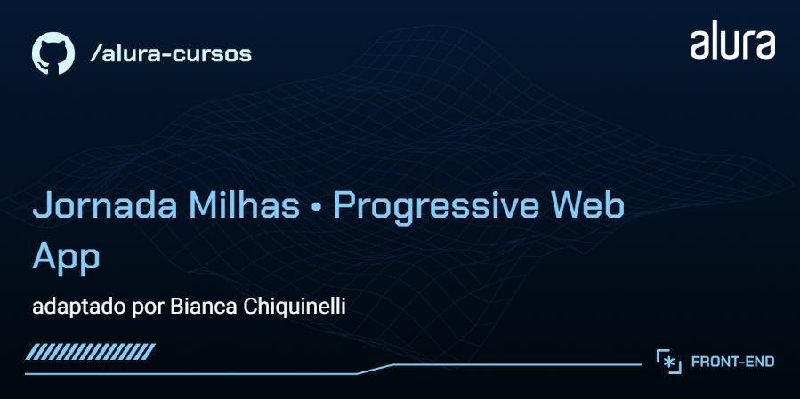
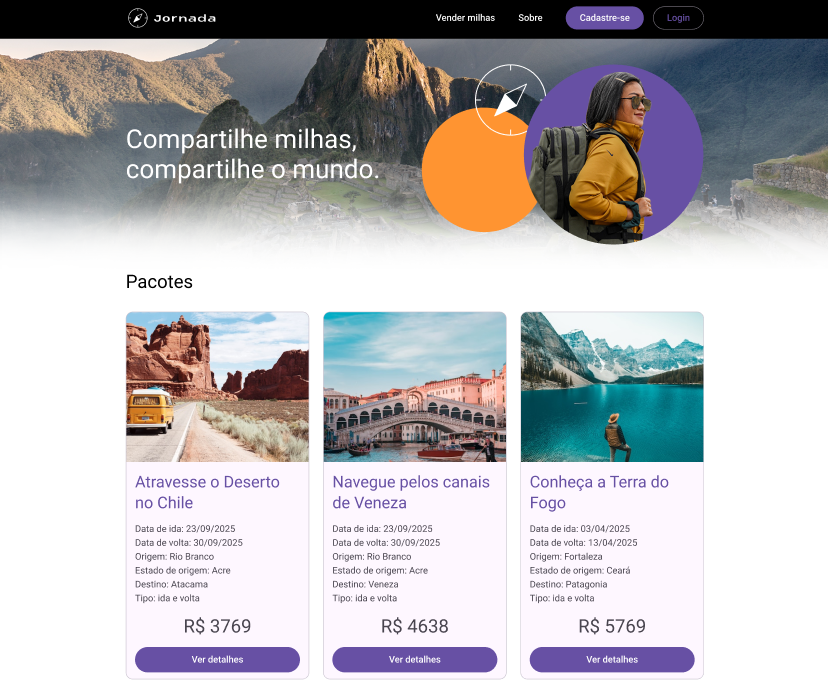

# Jornada Milhas



Aplicação web de viagens desenvolvida com foco em experiência responsiva e evolução para Progressive Web App (PWA), incorporando estratégias de cache, sincronização em segundo plano e notificações push para oferecer uma navegação mais fluida mesmo em cenários de conectividade instável.



## ✨ Funcionalidades

- Exibição de pacotes de viagens em interface responsiva
- Reserva de viagens com persistência de dados via MockAPI
- Instalação como PWA
- Notificações push em foreground e background
- Sincronização offline com Workbox Background Sync
- Cache estratégico e suporte offline

## ⚙️ Implementações técnicas

- Configuração de PWA com `VitePWA`
- Criação e registro manual de `Service Worker`
- Migração para utilização do `Workbox`
- Estratégias de cache para imagens e arquivos de estilo
- Configuração de `manifest.webmanifest`
- Integração com `Firebase Cloud Messaging`
- Implementação de sincronização em segundo plano com `Workbox Background Sync`
- Estratégias de cache para imagens, fontes e arquivos estáticos
- Definição de ícones, metadados e propriedades da aplicação instalável
- Otimização de carregamento de fontes locais

## 🧩 Tecnologias utilizadas

- `React` e `React Router DOM`
- `Vite` e `VitePWA`
- `JavaScript`
- `Firebase` e `Firebase Cloud Messaging`
- `React Toastify`
- `Workbox`

💡 Destaques do projeto

_A aplicação foi evoluída para lidar com cenários de conectividade limitada, utilizando sincronização em segundo plano para garantir persistência de requisições mesmo durante períodos offline._

_Além disso, a implementação de notificações push em foreground e background aproxima a experiência do comportamento esperado em aplicações modernas, reforçando aspectos de continuidade, resiliência e experiência do usuário._

## Como Ter Acesso ao Projeto

- **Versão online**: [Clique aqui](https://jornada-milhas-delta.vercel.app/)
- **Rodar localmente**:
  Clone o repositório e instale as dependências:

```bash
cd react-pwa
```

5. Instale as dependências usando o npm:

```bash
npm install
```

6. Inicie o projeto localmente:

```bash
npm run dev
```
